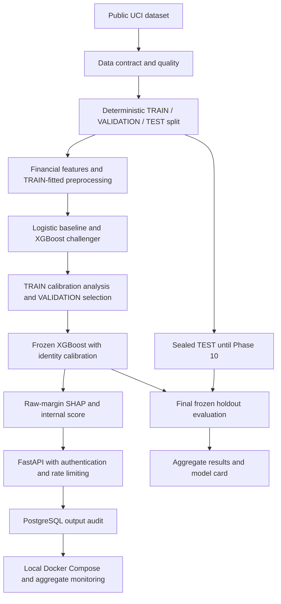

# Credit Risk Scoring & Explainability System

A portfolio credit-risk ML system with leakage-safe development, frozen holdout evaluation, raw-margin SHAP, an internal risk score and an auditable FastAPI service. It uses historical UCI Taiwan credit-card data to estimate **default payment next month**. The ten-phase core project is complete; `credit-risk-system-1.0.0` is prepared for owner review and release.

## What This Project Demonstrates

Reproducible data contracts, TRAIN-only model development, independent component identities, honest probability/explanation semantics, privacy-minimized PostgreSQL persistence, local container deployment and aggregate monitoring. No automated lending decision is implemented.

## Architecture



## Modeling Pipeline

30,000 records → seeded stratified TRAIN 21,000 / VALIDATION 4,500 / TEST 4,500. Nineteen financial predictors plus 26 engineered features become 103 TRAIN-fitted transformed columns. IDs, target and demographics are excluded from inference. Logistic is the baseline; XGBoost uses fold-local TRAIN search. TRAIN OOF calibration analysis selected identity for both; VALIDATION selected XGBoost in Phase 6. TEST stayed sealed until Phase 10. No retraining, calibration change or model reselection followed TEST results.

## Final Holdout Performance

| Metric | Logistic TEST | XGBoost TEST |
| --- | --- | --- |
| average_precision | 0.52981208 | 0.55493342 |
| brier_score | 0.13815888 | 0.13517626 |
| ece | 0.013705673 | 0.018104312 |
| gini | 0.5206425 | 0.56029254 |
| ks | 0.40494512 | 0.43652693 |
| log_loss | 0.44034703 | 0.43003453 |
| mean_predicted_probability | 0.22051946 | 0.22103783 |
| observed_positive_rate | 0.22133333 | 0.22133333 |
| roc_auc | 0.76032125 | 0.78014627 |

TEST prevalence: 996 / 4,500 = 22.1333%. XGBoost 95% AUC CI: [0.762707, 0.796668], using 1,000 paired row-bootstrap replicates, seed 42. Logistic has lower TEST ECE; XGBoost has better discrimination and Brier/log loss on this sample. XGBoost remains selected by the earlier development decision.

XGBoost TEST−VALIDATION differences: AUC −0.004158, AP −0.001279, Brier −0.000109 and log loss +0.001208. These small observed differences are consistent with similar generalization behavior, subject to sampling uncertainty; they do not establish absence of overfitting. [Full evaluation and paired intervals](docs/final_evaluation_report.md).

## Explainability

Tree SHAP explains the frozen XGBoost **raw margin**, with signed source/family aggregation. It is noncausal and does not add directly to probability. Global interpretation is VALIDATION-based. Phase 10 publishes only aggregate residual checks from a predeclared 32-row TEST sample. [Explainability](docs/explainability_report.md).

## Internal Risk Score

Base score 600 at good:bad odds 50:1; PDO 20. Higher score means lower modeled risk. It is an internal probability transformation, not FICO, risk bands or a lending cutoff. [Score contract](docs/internal_risk_score.md).

## API

`GET /v1/health/live`, `GET /v1/health/ready`, authenticated `GET /v1/model-info`, `POST /v1/predict` and `POST /v1/explain`. Frozen startup-loaded artifacts, API-key authentication, process-local rate limiting and mandatory PostgreSQL output audit. No raw inputs, secrets or full feature/SHAP vectors are persisted. [API](docs/api.md) · [Persistence](docs/persistence.md).

## Quick Start with Docker

Requires Docker Linux containers and **trusted existing frozen model/preprocessor artifacts** at manifest-declared paths under ignored `artifacts/`. Binaries and datasets are not distributed in the repository/image; missing artifacts fail explicitly. The API does not need the raw dataset.

```powershell
Copy-Item .env.example .env
# Replace credential placeholders locally with random secrets; never commit .env.
docker compose config --quiet
docker compose build
docker compose up -d db
docker compose run --rm migrate
docker compose up -d api
```

One non-root worker; read-only artifacts; PostgreSQL 17; Alembic `phase8_001`. Use the [deployment guide](docs/deployment.md) for credentials, artifact requirements, healthchecks, stopping services and limitations. No cloud deployment or TLS termination is supplied.

## Example API Request

Fabricated input only; no TEST record. Supply the same API secret used in the local deployment through the environment.

```powershell
$financial = @{ credit_limit = 200000 }
foreach ($month in @('09','08','07','06','05','04')) {
    $financial["repayment_status_2005_$month"] = -1
    $financial["bill_amount_2005_$month"] = 20000
    $financial["payment_amount_2005_$month"] = 20000
}
$body = $financial | ConvertTo-Json
Invoke-RestMethod -Uri http://127.0.0.1:8000/v1/predict -Method Post `
    -ContentType application/json -Headers @{ 'X-API-Key' = $env:CREDIT_RISK_API_KEY } -Body $body
```

The response contains probability, score and version identities, not approve/decline or a credit limit.

## Model Operations

```powershell
docker compose exec -T api python -m credit_risk.ops.run audit --hours 24
docker compose exec -T api python -m credit_risk.ops.run summary --hours 24 --minimum-count 100
```

Aggregate contract checks and output-distribution PSI against a frozen VALIDATION reference. No feature drift, realized-outcome performance monitoring or automatic retraining. [Operations](docs/model_operations.md).

## Testing

```powershell
python -m venv .venv
.venv\Scripts\python.exe -m pip install -e ".[dev]"
.venv\Scripts\python.exe -m pytest
.venv\Scripts\python.exe -m pip check
```

On POSIX use `.venv/bin/python`. Frozen numerical artifacts require the manifest-pinned runtime versions (verified on Python 3.14.6), beyond the package's declared Python 3.11+ minimum. Ordinary tests do not require Docker. Real-artifact tests explicitly skip when local prerequisites are absent; they do not train replacements or automatically unseal unpublished TEST. An explicit synthetic Docker/PostgreSQL integration runner is documented in the deployment guide.

## Repository Structure

```text
configs/                  versioned development and inference contracts
src/credit_risk/
  data/ features/         ingestion, schema, split, financial preprocessing
  modeling/               historical development and immutable experiments
  explainability/         raw-margin SHAP and internal score
  service/ api/           frozen runtime and versioned HTTP interface
  persistence/ ops/       PostgreSQL audit and aggregate operations
  evaluation/             no-fit final TEST evaluation and publication guard
data/metadata/            aggregate contracts, results and release identity
docs/                    model card, methodology, operations, phase reports
tests/                   synthetic and explicit real-artifact regression
scripts/                  synthetic live Compose verification
```

## Reproducibility

Supply trusted frozen artifacts and the pinned raw workbook separately; hashes are in tracked manifests. Source data acquisition: `python -m credit_risk.data.download`. This checks/reuses the pinned official bytes. Do not run historical training commands to reproduce the final evaluation.

```powershell
.venv\Scripts\python.exe -m credit_risk.evaluation.final --verify-existing
```

This reconstructs the existing split, transforms without fitting, evaluates the frozen models, and checks exact aggregate publication bytes without refreshing timestamps. Contract/result mismatches stop rather than overwrite. [Pre-unseal identity](data/metadata/final_pre_unseal_snapshot.json) · [Release manifest](data/metadata/final_release_manifest.json).

## Limitations

Historical Taiwan 2005 static data; no modern out-of-time validation. The target is not established as 90+ DPD, Basel PD or IFRS 9 lifetime PD. No bureau/affordability verification, reject inference, LGD/EAD or expected-loss engine. Demographic exclusion is not fairness certification. Local single-worker deployment lacks external secrets management, TLS, cloud HA and realized-performance monitoring. [All limitations](docs/limitations.md).

## Responsible Use

Educational portfolio work only. No real lending decision should rely on this system. No regulatory validation, fairness certification or adverse-action certification is claimed. Repository licensing remains unspecified; no LICENSE was added without owner authorization. Dataset attribution is separate.

## Documentation

[Model card](docs/model_card.md) · [Final evaluation](docs/final_evaluation_report.md) · [Subgroups](docs/subgroup_diagnostics.md) · [Portfolio overview](docs/portfolio_release.md) · [Dataset card](docs/dataset_card.md) · [Architecture](docs/architecture.md) · [Governance](docs/model_governance.md) · [Phase 10 report](docs/phase_reports/phase_10_completion_report.md)
