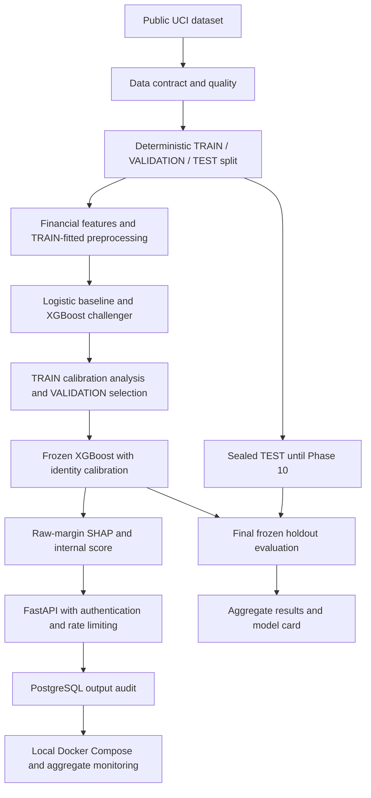

# Portfolio release: credit-risk-system-1.0.0

This educational project estimates a dataset-defined next-month default-payment event and makes model outputs traceable from public data to a versioned API and audit store. Credit-risk modeling supports risk assessment; it does not itself decide whether to lend.

The public UCI Taiwan 2005 dataset passes schema/hash/quality checks before a deterministic 70/15/15 split. Financial allowlisting and fold-local preprocessing prevent target/demographic leakage. A fixed Logistic baseline establishes a reference; TRAIN-only XGBoost search provides a challenger. TRAIN OOF calibration analysis selected identity, and development VALIDATION selected XGBoost before TEST was opened.

Raw-margin Tree SHAP, signed source aggregation and an internal log-odds score explain and represent the frozen output without inventing a business policy. FastAPI loads trusted artifacts once, enforces authentication/rate limits, and commits privacy-minimized outputs to PostgreSQL before success. Docker Compose separates database, migration and one non-root API worker. Read-only aggregate operations check audit identities and output-distribution PSI against a frozen VALIDATION reference.

Phase 10 opened the existing 4,500-row TEST only after freezing identities and diagnostic choices. Both models were evaluated without fitting. Seeded paired bootstrap, reliability bins, score deciles/lift, descriptive subgroup diagnostics and aggregate SHAP residuals are published. No customer-level TEST outputs are exported, and immutable reproduction retains publication identity.

| Metric | Logistic TEST | XGBoost TEST |
| --- | --- | --- |
| average_precision | 0.52981208 | 0.55493342 |
| brier_score | 0.13815888 | 0.13517626 |
| ece | 0.013705673 | 0.018104312 |
| gini | 0.5206425 | 0.56029254 |
| ks | 0.40494512 | 0.43652693 |
| log_loss | 0.44034703 | 0.43003453 |
| mean_predicted_probability | 0.22051946 | 0.22103783 |
| observed_positive_rate | 0.22133333 | 0.22133333 |
| roc_auc | 0.76032125 | 0.78014627 |

The final release is prepared for owner review; no commit, tag or hosted release was created automatically. This is a local portfolio demonstration, not evidence of bank adoption, production readiness or regulatory compliance. See [model card](model_card.md), [final evaluation](final_evaluation_report.md), [limitations](limitations.md) and [deployment](deployment.md). Repository licensing remains unspecified.
